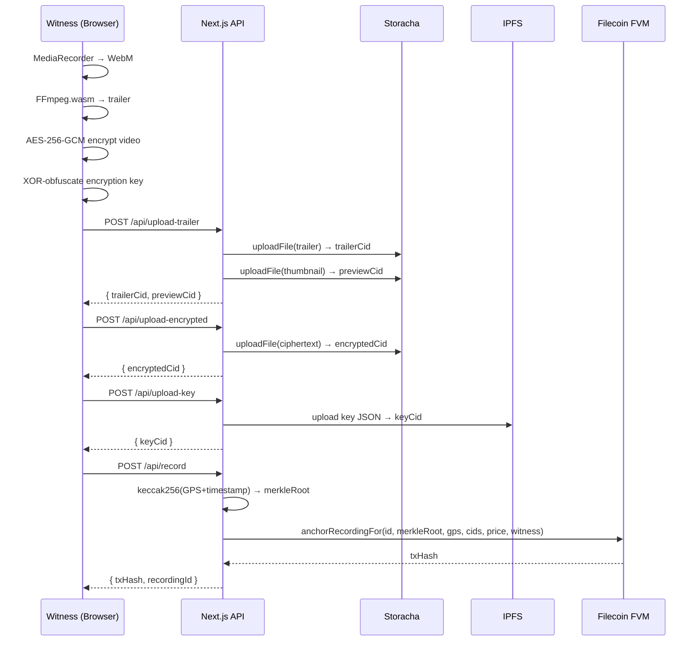
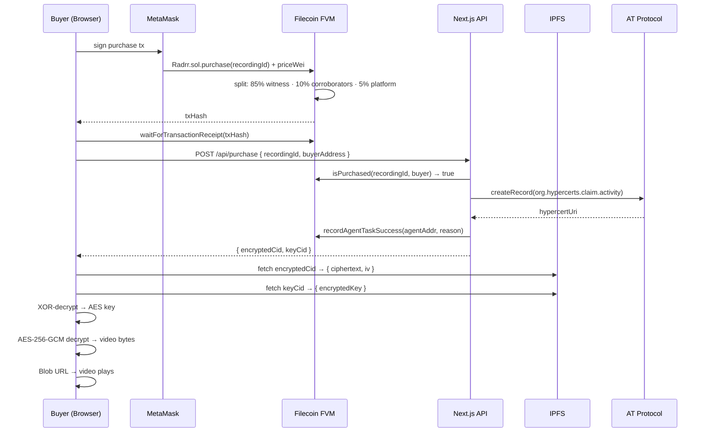
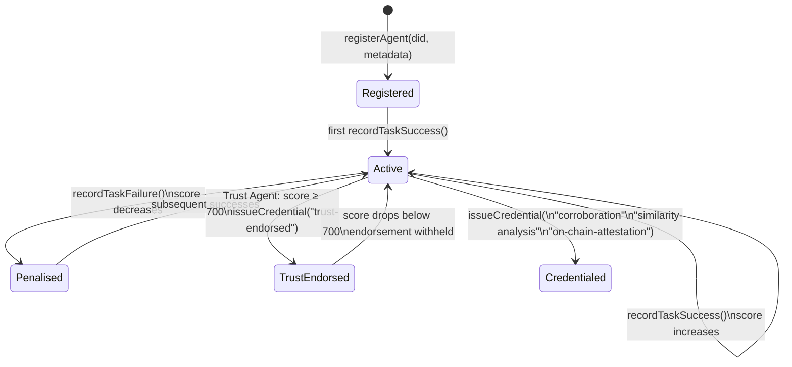

# Radrr

**A decentralised marketplace for citizen footage with cryptographic provenance — where eyewitnesses capture, verify, and sell recordings, and autonomous AI agents independently corroborate them on-chain.**

Every major news event of the last decade was first captured by an ordinary person on an ordinary phone. Yet there is no accessible way for that person to prove their footage is authentic, protect it from deletion, or get paid when it matters. Radrr fixes this — entirely in the browser, no app install, no professional equipment, no intermediary taking the majority of the money.

---

## Table of Contents

- [The Problem](#the-problem)
- [The Solution](#the-solution)
- [Flow Diagrams](#flow-diagrams)
  - [Recording Upload Flow](#recording-upload-flow)
  - [Purchase & Decryption Flow](#purchase--decryption-flow)
  - [AI Corroboration Loop](#ai-corroboration-loop)
  - [Agent Trust Chain](#agent-trust-chain)
- [Data Flow Diagrams](#data-flow-diagrams)
  - [End-to-End System](#end-to-end-system)
  - [Recording Upload Sequence](#recording-upload-sequence)
  - [Purchase Sequence](#purchase-sequence)
  - [ERC-8004 Agent Lifecycle](#erc-8004-agent-lifecycle)
- [Architecture](#architecture)
- [Tech Stack](#tech-stack)
- [Smart Contracts](#smart-contracts)
- [API Routes](#api-routes)
- [Project Structure](#project-structure)
- [Getting Started](#getting-started)
- [Sponsor Integrations](#sponsor-integrations)

---

## The Problem

When something happens in the world, the people nearest to it are the first to see it. A bystander films a protest. A driver captures a hit-and-run. A resident records illegal dumping. A journalist documents a raid.

But the current system fails them at every step:

- **Footage gets deleted** — by device failure, intimidation, or platform takedown
- **Provenance is invisible** — screenshots and re-uploads destroy the chain of custody
- **Recorders go uncompensated** — media outlets, lawyers, and insurers use the footage; the person who risked their safety sees nothing
- **No proof of authorship** — anyone can claim they filmed something
- **AI fakes erode trust** — without verifiable provenance, even real footage becomes suspect

The only video authentication solution available today is Sony's C2PA-compliant camera system — starting at **$6,499** plus a paid annual licence. It is designed for newsroom workflows, not citizen witnesses. Meanwhile, **416 million people across Africa** are recording the most significant local news events every day with no verifiable proof of authenticity.

---

## The Solution

Radrr is a decentralised footage marketplace built on cryptographic truth.

At capture time:
1. A **Merkle root** of GPS + timestamp is anchored on the **Filecoin FVM** — immutable, timestamped, on-chain
2. The full footage is **AES-256-GCM encrypted** client-side — no server ever holds the plaintext
3. The encrypted key is XOR-obfuscated, uploaded to IPFS, and the **keyCid stored on-chain**
4. A public trailer is **pinned to Filecoin** via Storacha — permanently accessible, censorship-resistant
5. Autonomous **AI agents** corroborate footage using SigLIP 2 visual embeddings — independent verification, not editorial judgment

At purchase:
- The witness receives **85% of the payment**, automatically, on-chain
- Corroborating agents share **10%** — incentivising independent verification
- The buyer receives a **Hypercert** — permanent proof they funded verified citizen journalism
- The video is decrypted **client-side** using the keyCid retrieved from on-chain

---

## Flow Diagrams

### Recording Upload Flow

```
Witness Browser
      │
      ├─[1]─ MediaRecorder API → WebM video
      │
      ├─[2]─ FFmpeg.wasm → trailer (first 15s, no audio)
      │
      ├─[3]─ Web Crypto API
      │       AES-256-GCM encrypt full video
      │       XOR-obfuscate encryption key with server secret
      │
      ├─[4]─ POST /api/upload-trailer ──────────────► Storacha
      │       thumbnail + trailer                      └─ trailerCid, previewCid
      │
      ├─[5]─ POST /api/upload-encrypted ───────────► Storacha
      │       AES ciphertext + IV                      └─ encryptedCid
      │
      ├─[6]─ POST /api/upload-key ─────────────────► IPFS
      │       XOR-encrypted key JSON                   └─ keyCid
      │
      └─[7]─ POST /api/record
              │
              ├─ keccak256(GPS + timestamp) → merkleRoot
              │
              └─ Radrr.sol.anchorRecordingFor(
                    recordingId, merkleRoot, gps,
                    trailerCid, encryptedCid, keyCid,
                    price, witness
                 )
                 └─► txHash on Filecoin FVM Calibration
```

### Purchase & Decryption Flow

```
Buyer Browser
      │
      ├─[1]─ MetaMask → Radrr.sol.purchase(recordingId) { value: priceWei }
      │                  └─ 85% → witness wallet   (automatic, on-chain)
      │                  └─ 10% → corroborators     (split per bundle entry)
      │                  └─  5% → platform
      │
      ├─[2]─ waitForTransactionReceipt(txHash)
      │
      ├─[3]─ POST /api/purchase { recordingId, buyerAddress }
      │       │
      │       ├─ isPurchased(recordingId, buyer) on Filecoin RPC → true
      │       ├─ mint Hypercert on AT Protocol (certified.one)
      │       ├─ recordAgentTaskSuccess on ERC-8004 registry
      │       └─ return { encryptedCid, keyCid }
      │
      ├─[4]─ fetch encryptedCid from IPFS → { ciphertext, iv }
      ├─[5]─ fetch keyCid from IPFS → { encryptedKey }
      ├─[6]─ XOR-decrypt key → raw AES-256-GCM key
      ├─[7]─ AES-256-GCM.decrypt(ciphertext, iv, key) → video bytes
      └─[8]─ Blob URL → <video> element plays full footage
```

### AI Corroboration Loop

```
Corroboration Agent  (runs every 30 seconds)
         │
    DISCOVER ──► fetch all recordings from Radrr.sol
         │
      PLAN ──────► group by GPS cluster (0.1° ≈ 10 km radius)
         │          filter clusters with ≥ 2 recordings
         │
    EXECUTE ──────► for each candidate pair:
         │           SigLIP 2 embeddings via HuggingFace API
         │           model: google/siglip-so400m-patch14-384
         │           cosine_similarity(embedding_a, embedding_b)
         │
     VERIFY ──────► score ≥ 0.85?
         │           YES ──► proceed
         │           NO  ──► skip pair, log result
         │
     COMMIT ──────► Radrr.sol.updateCorroboration(recordingId, bundleIds[])
         │
  REPUTATION ──────► AgentRegistry.sol.recordTaskSuccess(agent, reason)
         │
        LOG ──────► append structured entry to agent_log.json
                    store log on Filecoin via Storacha
```

### Agent Trust Chain

```
Trust Agent  (runs every 60 seconds)
         │
      FETCH ──► AgentRegistry.sol.getAgentReputation(corroborationAgent)
         │        └─ returns { score, tasksCompleted, tasksFailed }
         │
   EVALUATE ──► score ≥ 700 / 1000?
         │
        YES ──► issueCredential(corroborationAgent, "trust-endorsed", evidenceCid)
         │       recordAgentTaskSuccess(trustAgent, "trust check passed")
         │       log: "trust-endorsed credential issued"
         │
         NO ──► recordAgentTaskFailure(trustAgent, "score below threshold")
                log: "endorsement withheld — attestation flagged as unendorsed"
```

---

## Data Flow Diagrams

### End-to-End System

```mermaid
graph TB
    subgraph Browser
        W([Witness])
        B([Buyer])
    end

    subgraph NextJS["Next.js API"]
        AR[/api/record]
        AU[/api/upload-*]
        AP[/api/purchase]
        AC[/api/corroborate]
        AG[/api/agent]
    end

    subgraph FVM["Filecoin FVM · chain 314159"]
        RS[("Radrr.sol")]
        RG[("AgentRegistry.sol")]
    end

    subgraph Storage["Decentralised Storage"]
        ST[(Storacha / Filecoin)]
        IP[(IPFS)]
    end

    subgraph Agents["Autonomous Agents · Node.js"]
        CA[Corroboration Agent\n30s loop]
        TA[Trust Agent\n60s loop]
    end

    W -->|"encrypt + upload"| AU
    AU -->|"trailer, thumbnail, ciphertext"| ST
    AU -->|"XOR-encrypted key"| IP
    W -->|"anchor"| AR
    AR -->|"anchorRecordingFor()"| RS
    RS -.->|"85% tFIL on purchase"| W
    B -->|"purchase() + tFIL"| RS
    B -->|"verify"| AP
    AP -->|"isPurchased()"| RS
    AP -->|"encryptedCid + keyCid"| B
    B -->|"fetch ciphertext"| ST
    B -->|"fetch key"| IP
    CA -->|"updateCorroboration()"| RS
    CA -->|"recordTaskSuccess()"| RG
    TA -->|"getAgentReputation()"| RG
    TA -->|"issueCredential()"| RG
    AP -->|"recordTaskSuccess()"| RG
    AG -->|"getAgentReputation()"| RG
```

### Recording Upload Sequence



### Purchase Sequence



### ERC-8004 Agent Lifecycle



---

## Architecture

```
radrr-app/
│
├── Browser (client-side)
│   ├── /record           MediaRecorder + FFmpeg.wasm + AES-256-GCM + XOR key
│   ├── /marketplace      Browse, filter, bid on footage
│   ├── /recording/[id]   Trailer, purchase, client-side decrypt, corroboration links
│   ├── /dashboard        Witness recordings, buyer purchases, open bids
│   └── /agent            ERC-8004 reputation gauge, credentials, activity log
│
├── Next.js API (server-side)
│   ├── /api/record           Merkle root + anchorRecordingFor on Filecoin FVM
│   ├── /api/upload-*         Storacha + IPFS uploads
│   ├── /api/purchase         isPurchased check + Hypercert mint + reputation update
│   ├── /api/corroborate      SigLIP 2 similarity + updateCorroboration on-chain
│   ├── /api/agent            ERC-8004 reputation, credentials, activity log
│   ├── /api/recordings       Public listing from Filecoin FVM
│   ├── /api/bids             Bid queries
│   └── /api/identity         Agent identity lookup
│
├── Filecoin FVM (chain 314159)
│   ├── Radrr.sol             Anchor, purchase (85/10/5 tFIL splits), bids, bundles
│   └── AgentRegistry.sol     ERC-8004: identity + reputation + validation registries
│
├── Autonomous Agents (Node.js, long-running)
│   ├── corroboration-agent.ts   SigLIP 2 poll loop, 30s interval
│   └── trust-agent.ts           Reputation monitor + credential issuance, 60s interval
│
└── Decentralised Storage
    ├── Storacha (w3up)      Videos, trailers, thumbnails, metadata, agent logs
    └── IPFS                 AES key bundles (keyCid stored on-chain in Radrr.sol)
```

---

## Tech Stack

| Layer | Technology | Purpose |
|---|---|---|
| Frontend | Next.js 15 App Router, React 19, Tailwind CSS v4 | UI |
| Recording | MediaRecorder API, FFmpeg.wasm | In-browser WebM capture + trailer generation |
| Encryption | AES-256-GCM (Web Crypto API) + XOR key obfuscation | Client-side video encryption — server never sees plaintext |
| Blockchain | Filecoin FVM Calibration (chain 314159), viem | Immutable anchoring, purchase splits, bidding |
| Smart contracts | Solidity 0.8, Hardhat | Radrr.sol, AgentRegistry.sol |
| Storage | Storacha (w3up / @storacha/client) | All video + metadata + agent logs on Filecoin |
| AI corroboration | SigLIP 2 via HuggingFace Inference API | Visual embedding cosine similarity, threshold 0.85 |
| Agent identity | ERC-8004 (all 3 registries on-chain) | Agent identity, reputation, validation |
| Certificates | AT Protocol (certified.one PDS) | Hypercerts minted on every purchase |
| Wallet | wagmi + MetaMask injected connector | Filecoin tFIL transactions |
| Geocoding | Nominatim (OpenStreetMap) | Reverse geocoding GPS coords → city name |
| Storage payments | Synapse SDK | Integrated with Multicall3 override; full payment ready once Synapse ships Calibration |

---

## Smart Contracts

**Network:** Filecoin Calibration Testnet · chain ID 314159
**Explorer:** [calibration.filfox.info](https://calibration.filfox.info/en)

| Contract | Address | Description |
|---|---|---|
| `Radrr.sol` | `0x0B02E8eC8624E7e0024979D14735Bb5F4c10B182` | Core marketplace: anchor, purchase (85/10/5 split), bids, corroboration bundles |
| `AgentRegistry.sol` | `0x76bd383BB3a4824131DC114dfE79e2BC0CfE6c89` | ERC-8004: identity registry, reputation registry, validation registry |

Corroboration agent registered at `0x3cfeCc707FA2a5b43DB15dA6891bfA8DA9fc2F66`.

---

## API Routes

| Route | Method | Description |
|---|---|---|
| `/api/record` | POST | Compute Merkle root + anchor recording on Filecoin FVM |
| `/api/upload` | POST | Upload raw video to Storacha |
| `/api/upload-trailer` | POST | Upload public trailer + thumbnail to Storacha |
| `/api/upload-encrypted` | POST | Upload AES-256-GCM encrypted video to Storacha |
| `/api/upload-key` | POST | Upload XOR-encrypted key JSON to IPFS |
| `/api/purchase` | POST | Verify on-chain purchase · return encryptedCid+keyCid · mint Hypercert · update agent reputation |
| `/api/corroborate` | POST | Run SigLIP 2 similarity + update corroboration bundle on-chain |
| `/api/agent` | GET | ERC-8004 reputation, credentials, recent activity log |
| `/api/recordings` | GET | List public recordings from Filecoin FVM |
| `/api/identity` | GET | ERC-8004 agent identity lookup |
| `/api/bids/by-bidder/[address]` | GET | Bids placed by a wallet |
| `/api/hypercerts/by-owner/[address]` | GET | Hypercerts owned by a wallet |

---

## Project Structure

```
radrr-app/
├── agents/
│   ├── corroboration-agent.ts  # ERC-8004 autonomous SigLIP 2 corroboration loop
│   └── trust-agent.ts          # Monitors corroboration agent reputation, issues trust-endorsed credential
├── app/
│   ├── agent/                  # Agent status page — reputation gauge, credentials, activity log
│   ├── api/
│   │   ├── agent/              # ERC-8004 reputation + log API
│   │   ├── anchor/             # Recording anchor
│   │   ├── bids/               # Bid queries
│   │   ├── corroborate/        # SigLIP 2 pipeline
│   │   ├── hypercerts/         # Hypercert queries
│   │   ├── identity/           # Agent identity
│   │   ├── purchase/           # Purchase verification + Hypercert + reputation
│   │   ├── recordings/         # Public listing
│   │   ├── release-key/        # Server-side XOR key release
│   │   ├── upload/             # Raw video upload
│   │   ├── upload-encrypted/   # Encrypted video upload
│   │   ├── upload-key/         # Key upload to IPFS
│   │   ├── upload-thumbnail/   # Thumbnail upload
│   │   └── upload-trailer/     # Trailer upload
│   ├── dashboard/              # Witness/buyer dashboard
│   ├── marketplace/            # Browse + filter + bid
│   ├── record/                 # In-browser recording UI
│   ├── recording/[id]/         # Detail page + purchase + client-side decryption
│   └── page.tsx                # Homepage — live feed + features + CTA
├── components/
│   ├── Navbar.tsx              # Navigation: Browse, Record, Dashboard, Agent
│   ├── FootageCard.tsx         # Homepage footage card with geocoded location
│   ├── MarketplaceCard.tsx     # Marketplace card — bid + buy
│   └── ConnectWallet.tsx       # wagmi wallet connection (injected connector)
├── contracts/filecoin/
│   └── src/
│       ├── Radrr.sol           # Core marketplace contract
│       └── AgentRegistry.sol   # ERC-8004 identity + reputation + validation
├── hooks/
│   └── useLocationName.ts      # Reverse geocoding hook (Nominatim)
├── lib/
│   ├── encryption-client.ts    # AES-256-GCM + XOR key obfuscation (browser)
│   ├── filecoin.ts             # viem FVM contract interactions
│   ├── geocode.ts              # Nominatim reverse geocoding with module-level cache
│   ├── hypercerts.ts           # AT Protocol Hypercert minting
│   ├── siglip.ts               # SigLIP 2 embeddings via HuggingFace
│   ├── storacha.ts             # Storacha w3up client
│   └── synapse.ts              # Synapse SDK client
└── public/
    ├── agent.json              # ERC-8004 agent manifest (machine-readable)
    └── agent_log.json          # Structured execution log
```

---

## Getting Started

### Prerequisites

- Node.js 20+
- A Filecoin Calibration wallet with tFIL — [faucet](https://faucet.calibration.fildev.network/)
- Storacha space + delegation proof
- HuggingFace API key (for SigLIP 2)
- certified.one account (for Hypercerts)

### Install

```bash
npm install
```

### Environment Variables

Copy `.env.local.example` to `.env.local`:

| Variable | Description |
|---|---|
| `FILECOIN_CONTRACT_ADDRESS` | Radrr.sol address on Calibration |
| `FILECOIN_AGENT_REGISTRY_ADDRESS` | AgentRegistry.sol address |
| `FILECOIN_AGENT_ADDRESS` | Corroboration agent wallet address |
| `FILECOIN_AGENT_PRIVATE_KEY` | Agent private key (`0x...`) |
| `FILECOIN_RPC_URL` | Calibration RPC (default: glif.io) |
| `NEXT_PUBLIC_FILECOIN_CONTRACT_ADDRESS` | Same, exposed to browser |
| `NEXT_PUBLIC_FILECOIN_RPC_URL` | Same, exposed to browser |
| `EVM_PLATFORM_PRIVATE_KEY` | Platform deployer wallet private key |
| `ENCRYPTION_SECRET` | Server secret for XOR key obfuscation |
| `STORACHA_PROOF` | Base64-encoded w3up delegation CAR |
| `STORACHA_PRINCIPAL` | Base64-encoded ed25519 principal (optional) |
| `CERTIFIED_APP_HANDLE` | certified.one handle |
| `CERTIFIED_APP_PASSWORD` | AT Protocol app password |
| `CERTIFIED_APP_PDS` | PDS URL (`https://certified.one`) |
| `HUGGINGFACE_API_KEY` | HuggingFace token for SigLIP 2 |

### Storacha Space Setup

```bash
npm install -g @web3-storage/w3cli
w3 login <email>
w3 space create radrr-space
# Start the app once to get your server DID, then:
w3 delegation create <server-did> --can 'store/add' --can 'upload/add' | base64
# Paste output into STORACHA_PROOF
```

### Run

```bash
npm run dev
```

### Run Agents

```bash
# Corroboration agent — polls every 30s
npx ts-node agents/corroboration-agent.ts

# Trust agent — polls every 60s
npx ts-node agents/trust-agent.ts
```

### Deploy Contracts

```bash
cd contracts/filecoin
npx hardhat run deploy.ts --network filecoin_calibration
```

---

## Sponsor Integrations

### Filecoin / FVM
- `Radrr.sol` and `AgentRegistry.sol` deployed on Filecoin FVM Calibration (chain 314159)
- Merkle root of GPS + timestamp anchored at capture time — immutable before any sale
- Purchase enforces automatic 85/10/5 tFIL splits on-chain, no intermediary
- All viem contract interactions in `lib/filecoin.ts`

### Storacha
- `@storacha/client` for all persistent storage — no central server holds video
- `uploadFile()` for encrypted video, trailers, thumbnails
- `uploadJson()` for recording metadata and agent execution logs
- Stable `ed25519` principal across restarts via `STORACHA_PRINCIPAL`
- Synapse SDK integrated with custom Multicall3 override for Calibration

### ERC-8004 (Agents With Receipts)
- `AgentRegistry.sol` implements all three ERC-8004 registries in a single contract
- Every corroboration creates an immutable on-chain validation record
- Two autonomous agents: corroboration agent (SigLIP 2) + trust agent (reputation monitor)
- Trust agent endorses only if corroboration agent score ≥ 700/1000 — trust is earned, not assumed
- Purchase events call `recordAgentTaskSuccess()` — the marketplace directly feeds agent reputation
- `/agent` page visualises reputation gauge, credentials, and activity log with Filfox tx links
- `public/agent.json` is the machine-readable ERC-8004 agent manifest

### Hypercerts (AT Protocol)
- Minted on every verified purchase via `org.hypercerts.claim.activity` on certified.one PDS
- Buyers hold a portable credential proving they funded verified citizen journalism
- Queryable by wallet address via `/api/hypercerts/by-owner/[address]`

### SigLIP 2 / AI Corroboration
- `google/siglip-so400m-patch14-384` via HuggingFace Inference API
- Visual embeddings compared with cosine similarity — threshold 0.85
- Corroborating agents earn 10% of every future purchase of recordings they verify
- Full 7-phase decision loop (discover → plan → execute → verify → commit → reputation → log)
- All phases logged to `agent_log.json` and stored on Filecoin
