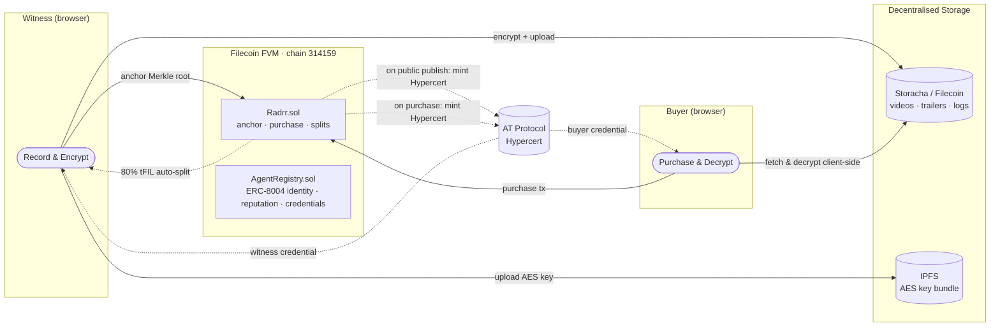
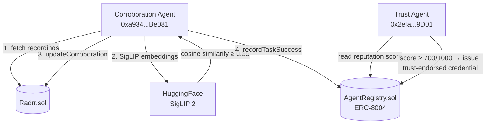

# Radrr

**A decentralised marketplace where eyewitnesses capture, verify, and sell footage — with cryptographic proof of authenticity built in from the moment of recording.**

---

## Table of Contents

- [The Problem](#the-problem)
- [The Solution](#the-solution)
- [How It Works](#how-it-works)
- [The Agent Network](#the-agent-network)
- [Tech Stack](#tech-stack)
- [Smart Contracts](#smart-contracts)
- [Getting Started](#getting-started)
- [Technologies / Tools Integrated](#technologies--tools-integrated)

---

## The Problem

When something happens in the world, the people nearest to it are the first to film it. But the current system fails them:

- **Footage gets deleted** — by device failure, intimidation, or platform takedown
- **Provenance is invisible** — screenshots and re-uploads destroy the chain of custody
- **Recorders go uncompensated** — media outlets, lawyers, and insurers use the footage; the person who risked their safety sees nothing
- **AI fakes erode trust** — without verifiable provenance, even real footage becomes suspect

The only video authentication solution available today is Sony's C2PA-compliant camera system — starting at **$6,499** plus a paid annual licence, designed for newsroom workflows. Meanwhile, **416 million people across Africa** are recording significant local events every day with no way to prove authenticity.

---

## The Solution

Radrr anchors footage to the public record the moment it is captured — before any sale, before any negotiation, before anyone can pressure a witness to delete it.

**At capture:** A Merkle root of GPS + timestamp is written to the Filecoin FVM. The full video is AES-256-GCM encrypted client-side (the server never sees plaintext) and stored on Filecoin via Storacha. A public trailer is pinned separately. Two autonomous AI agents independently corroborate the footage on-chain.

**At purchase:** The smart contract automatically splits payment — 80% to the witness, 10% to a journalism fund for freely listed footage, 10% to the platform. The buyer receives a Hypercert (permanent proof they funded verified citizen journalism) and decrypts the video entirely in-browser — no server ever holds the key.

**Hypercerts are minted in two cases:** when a witness publishes footage publicly (`visibilityLevel: full`), and when a buyer completes a purchase. Both events produce a permanent, portable credential on the AT Protocol PDS.

---

## How It Works



---

## The Agent Network

Two ERC-8004 autonomous agents run continuously on Filecoin Calibration, each with a registered on-chain identity, reputation score, and credential history.



**Corroboration Agent** — polls every 30 seconds. Groups recordings by GPS cluster, runs SigLIP 2 visual embeddings via HuggingFace, and writes corroboration bundles on-chain if cosine similarity ≥ 0.85. Every outcome (success or failure) updates its ERC-8004 reputation score.

**Trust Agent** — polls every 60 seconds. Reads the corroboration agent's on-chain reputation score. Only issues a `trust-endorsed` credential if the score is ≥ 700/1000 — making trust in AI attestations earned and auditable, not assumed.

Both agents expose a live status page at `/agent` with reputation gauges, earned credentials, and structured activity logs linked to the Filecoin explorer.

---

## Tech Stack

| Layer | Technology | Purpose |
|---|---|---|
| Frontend | Next.js 15 App Router, React 19, Tailwind CSS v4 | UI |
| Recording | MediaRecorder API, FFmpeg.wasm | In-browser WebM capture + trailer generation |
| Encryption | AES-256-GCM (Web Crypto API) + XOR key obfuscation | Client-side — server never sees plaintext |
| Blockchain | Filecoin FVM Calibration (chain 314159), viem | Anchoring, purchase splits, bidding |
| Smart Contracts | Solidity 0.8, Hardhat | Radrr.sol, AgentRegistry.sol |
| Storage | Storacha (`@storacha/client`) | All video, metadata, and agent logs on Filecoin |
| AI Corroboration | SigLIP 2 via HuggingFace Inference API | Visual embedding cosine similarity, threshold 0.85 |
| Agent Identity | ERC-8004 (all 3 registries on-chain) | Agent identity, reputation, validation |
| Certificates | AT Protocol (certified.one PDS) | Hypercerts minted on every purchase |
| Wallet | wagmi + MetaMask injected connector | Filecoin tFIL transactions |
| Geocoding | Nominatim (OpenStreetMap) | Reverse geocoding GPS → city name |
| Location Display | useLocationName hook | Shows city name with GPS coordinates on video cards |
| Storage Payments | Synapse SDK | Integrated with Multicall3 override for Calibration |

---

## Smart Contracts

**Network:** Filecoin Calibration Testnet · chain ID 314159
**Explorer:** [calibration.filfox.info](https://calibration.filfox.info/en)

| Contract | Address |
|---|---|
| `Radrr.sol` | `0x0B02E8eC8624E7e0024979D14735Bb5F4c10B182` |
| `AgentRegistry.sol` | `0x76bd383BB3a4824131DC114dfE79e2BC0CfE6c89` |
| Corroboration Agent | `0xa93414A1E97C09f982b83E2134E21C1Cb46Be081` |
| Trust Agent | `0x2efa5ebcA68341C3f9c21d02426Bca69aEe19D01` |

`Radrr.sol` handles: footage anchoring, on-chain purchases (80/10/10 tFIL splits), bidding, and corroboration bundles.

`AgentRegistry.sol` implements all three ERC-8004 registries in a single contract: identity (`registerAgent`), reputation (`recordTaskSuccess` / `recordTaskFailure`), and validation (`issueCredential` / `hasCredential`).

---

## Getting Started

### Prerequisites

- Node.js 20+
- A Filecoin Calibration wallet with tFIL — [faucet](https://faucet.calibration.fildev.network/)
- Storacha space + delegation proof
- HuggingFace API key (for SigLIP 2)
- certified.one account (for Hypercerts)

### Install & Run

```bash
npm install
npm run dev
```

### Environment Variables

Copy `.env.local.example` to `.env.local`:

| Variable | Description |
|---|---|
| `FILECOIN_CONTRACT_ADDRESS` | Radrr.sol address on Calibration |
| `FILECOIN_AGENT_REGISTRY_ADDRESS` | AgentRegistry.sol address |
| `FILECOIN_AGENT_ADDRESS` | Corroboration agent wallet address |
| `FILECOIN_AGENT_PRIVATE_KEY` | Corroboration agent private key (`0x...`) |
| `FILECOIN_TRUST_AGENT_ADDRESS` | Trust agent wallet address |
| `FILECOIN_TRUST_AGENT_PRIVATE_KEY` | Trust agent private key (`0x...`) |
| `FILECOIN_RPC_URL` | Calibration RPC (default: glif.io) |
| `NEXT_PUBLIC_FILECOIN_CONTRACT_ADDRESS` | Same, exposed to browser |
| `NEXT_PUBLIC_FILECOIN_RPC_URL` | Same, exposed to browser |
| `EVM_PLATFORM_PRIVATE_KEY` | Platform deployer wallet private key |
| `ENCRYPTION_SECRET` | Server secret for XOR key obfuscation |
| `STORACHA_PROOF` | Base64-encoded w3up delegation CAR |
| `STORACHA_PRINCIPAL` | Base64-encoded ed25519 principal (optional) |
| `CERTIFIED_APP_HANDLE` | certified.one account handle (e.g., user@certified.app) |
| `CERTIFIED_APP_PASSWORD` | certified.one app password |
| `CERTIFIED_APP_PDS` | certified.one PDS URL (default: https://certified.one) |
| `CERTIFIED_APP_DID` | Your AT Protocol DID from certified.one |
| `HUGGINGFACE_API_KEY` | HuggingFace token for SigLIP 2 |

### Storacha Space Setup

```bash
npm install -g @web3-storage/w3cli
w3 login <email>
w3 space create radrr-space
# Start the app once to get your server DID, then:
w3 delegation create <server-did> --can 'store/add' --can 'upload/add' | base64
# Paste output into STORACHA_PROOF
```

### Run Agents

```bash
# Corroboration agent — polls every 30s
npx tsx agents/corroboration-agent.ts

# Trust agent — polls every 60s
npx tsx agents/trust-agent.ts
```

### Deploy Contracts

```bash
cd contracts/filecoin
npx hardhat run deploy.ts --network filecoin_calibration
```

---

## Technologies / Tools Integrated

### Filecoin / FVM
- `Radrr.sol` and `AgentRegistry.sol` deployed on Filecoin FVM Calibration (chain 314159)
- Merkle root of GPS + timestamp anchored at capture time — immutable before any sale
- Purchase enforces automatic 80/10/10 tFIL splits on-chain, no intermediary
- All viem contract interactions in `lib/filecoin.ts`

### Storacha
- `@storacha/client` for all persistent storage — no central server holds video
- Encrypted video, public trailers, thumbnails, recording metadata, and agent execution logs
- Stable `ed25519` principal across restarts via `STORACHA_PRINCIPAL`
- Synapse SDK integrated with custom Multicall3 override for Calibration

### ERC-8004 (Agents With Receipts)
- `AgentRegistry.sol` implements all three ERC-8004 registries in a single contract
- Two autonomous agents registered on-chain with distinct identities and wallets
- Every corroboration creates an immutable on-chain validation record
- Trust agent endorses only if corroboration agent score ≥ 700/1000 — trust is earned, not assumed
- Purchase events call `recordAgentTaskSuccess()` — marketplace activity feeds agent reputation
- `public/agent.json` is the machine-readable ERC-8004 agent manifest
- `agent_log.json` is the structured execution log

### Hypercerts (AT Protocol / certified.one)
- Hypercerts minted via AT Protocol on certified.one PDS using `org.hypercerts.claim.activity` records
- Minted on two events: witness publishing footage publicly (`visibility: full`), and buyer completing a verified purchase
- Queryable by wallet address via `com.atproto.repo.listRecords` at `/api/hypercerts/by-owner/[address]`
- Portable, permanent credentials stored on your PDS — no blockchain gas fees

### SigLIP 2 / AI Corroboration
- `google/siglip-so400m-patch14-384` via HuggingFace Inference API
- Visual embeddings compared with cosine similarity — threshold 0.85
- Corroborating agents build reputation that unlocks platform governance rights
- Full 7-phase decision loop: discover → plan → execute → verify → commit → reputation → log
- All phases logged to `agent_log.json` and stored on Filecoin via Storacha
